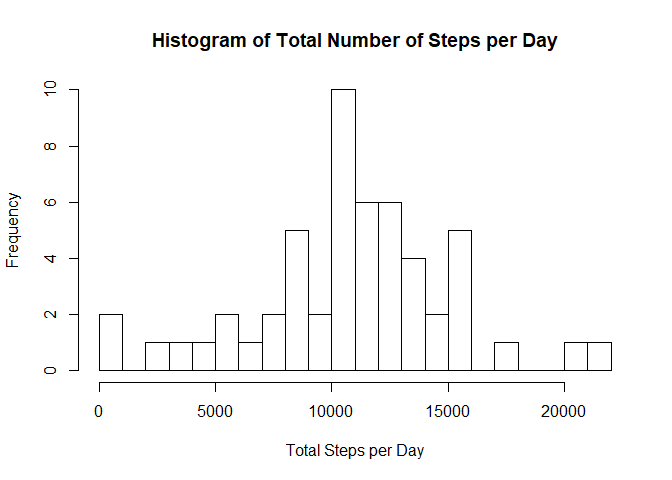
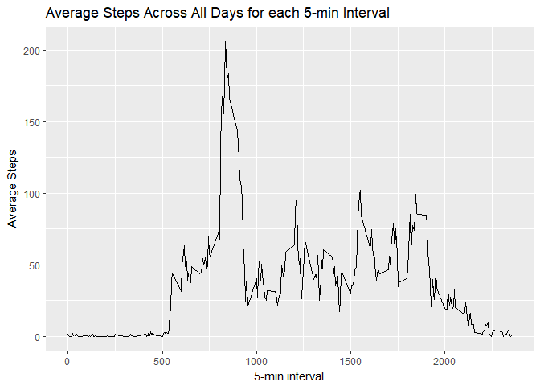
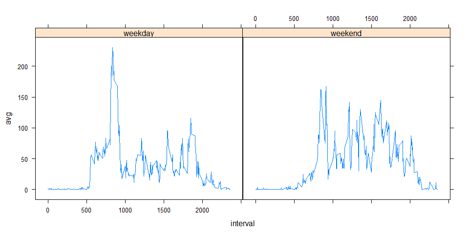

## Loading and preprocessing the data
Data is first loaded from the "activity.zip" file included in this repository.  This file is accessed from the local directory using the following code:


```r
filename <- "activity.zip"
destfile <- "activity.csv"
data <- read.csv(unz(filename, destfile))
unlink(destfile)
```

The data is then pre-processed with the following code in order to generate variables of the correct class:

```r
data$date <- as.Date(data$date)
data$steps <- as.numeric(data$steps)
```


## What is mean total number of steps taken per day?

First, the dataset is grouped by day and summed over each day in order to determine the total number of steps taken in each day.  The output is a 2-column array of 61 observations containing the total number of steps taken in each day:


```r
library(dplyr)
day_steps <- data %>% group_by(date) %>% summarize(sums = sum(steps))
```


```r
head(day_steps)
```

```
## # A tibble: 6 x 2
##         date  sums
##       <date> <dbl>
## 1 2012-10-01    NA
## 2 2012-10-02   126
## 3 2012-10-03 11352
## 4 2012-10-04 12116
## 5 2012-10-05 13294
## 6 2012-10-06 15420
```


A histogram is then created with this dataframe using 25 breaks to give a better picture.


```r
hist(day_steps$sums, breaks = 25, xlab = "Total Steps per Day", main = "Histogram of Total Number of Steps per Day")
```

<!-- -->

The mean and median number of steps taken per day are then calculated.


```r
mean1 <- mean(day_steps$sums, na.rm = TRUE)
med1 <- median(day_steps$sums, na.rm = TRUE)
data.frame(mean = mean1, median = med1)
```

```
##       mean median
## 1 10766.19  10765
```


## What is the average daily activity pattern?

In order to determine the average daily pattern, the average number of steps for each daily 5-minute interval must be calcuated (averaging across all days in the dataset for each interval).  The following code calculates this.


```r
intavg <- data %>% group_by(interval) %>% summarize(avg = mean(steps, na.rm = TRUE))
```

A time-series plot of this data is then created to visualize the average daily pattern of steps for each 5-minute interval.


```r
library(ggplot2)
ggplot(data = intavg, aes(x=interval, y= avg)) +
xlab("5-min interval") +
ylab("Average Steps") +
ggtitle("Average Steps Across All Days for each 5-min Interval") +
geom_line()
```

<!-- -->

The interval with the maximum number of steps is then identified using the following code:


```r
max_i <- intavg[intavg$avg == max(intavg$avg),][1]
```

The 5-minute interval with the maximum average number of steps is interval number 835.

## Imputing missing values

The dataset contains NA values.  The total number of NA values is determined using the following code:


```r
NAs <- sum(is.na(data))
```

The dataset contains a total of 2304 NA values.  We wish to impute these values.  An algorithm was created to replace NA values with the average (across all days in the dataset) for the 5-minute interval containing that NA value.  This is done with a new dataset ("data2"), using the following "for" loop and the previously calculated average daily 5-minute intervals:


```r
data2 <- data
for (i in 1:length(data2$steps)){
  if (is.na(data2$steps[i])){
    data2[i,"steps"] <- intavg[intavg$interval==data2[i,"interval"],2]
  }
}
```

The total number of steps for each day is determined for the new imputed dataset.  Then a new histogram of the total number of steps per day is then created and compared to the previous histogram to show the impact of imputing NA values.


```r
day_steps2 <- data2 %>% group_by(date) %>% summarize(sums = sum(steps))
head(day_steps2)
```

```
## # A tibble: 6 x 2
##         date     sums
##       <date>    <dbl>
## 1 2012-10-01 10766.19
## 2 2012-10-02   126.00
## 3 2012-10-03 11352.00
## 4 2012-10-04 12116.00
## 5 2012-10-05 13294.00
## 6 2012-10-06 15420.00
```


```r
par(mfrow = c(1,2), margin(c(2,2,4,4)))
hist(day_steps$sums, breaks = 25, xlab = "Total Steps", main = "Total Number of Steps per Day")
hist(day_steps2$sums, breaks = 25, xlab = "Total Steps", main = "Total Number of Steps per Day with Imputed Data")
```

<!-- -->

A comparison of the mean and median shows the differences in the imputed dataset vs. the original dataset.


```r
mean2 <- mean(day_steps2$sums)
med2 <- median(day_steps2$sums)

stats <- data.frame("Original" = c(mean1, med1), "Imputed" = c(mean2, med2), row.names = c("mean", "median"))
head(stats)
```

```
##        Original  Imputed
## mean   10766.19 10766.19
## median 10765.00 10766.19
```


## Are there differences in activity patterns between weekdays and weekends?

In order to determine if there is a difference in the average daily pattern between weekends and weekdays, an additional variable is created containing a binary label ("weekday" or "weekend") for each observation.  A panel plot comapting the average daily pattern for weekends and weekdays is shown below.  This clearly shows a difference in the average daily pattern between weekend and weekday days.


```r
####Create new factor variable with binary "weekend/weekday" label
data3 <- mutate(data2, day = rep("NA", dim(data2)[1]))
data3[weekdays(data3$date)=="Saturday" | weekdays(data3$date) == "Sunday","day"] = "weekend"
data3[data3$day == "NA","day"] = "weekday"
data3$day <- as.factor(data3$day)

####Create panel plot of weekday and weekend trends
library(lattice)
intavg2 <- data3 %>% group_by(interval, day) %>% summarize(avg = mean(steps))
xyplot(avg ~ interval| factor(day), data = intavg2, type = "l")
```

<!-- -->

